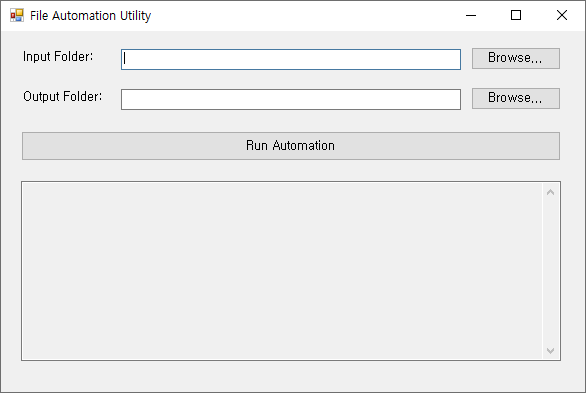
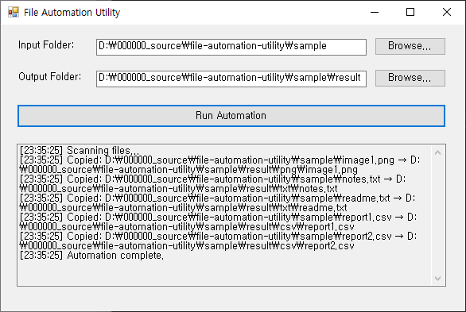

---

## Overview
A lightweight file automation utility that batch-processes thousands of files with predictable rules, clear logs, and a re-runnable workflow.

---

## What this is for
- Reducing repetitive file handling work across internal operations.
- Running safe, rule-based bulk actions with traceable results.

---

## Key features
- Simple input/output selection and rule-based execution.
- Batch processing with progress and structured logs.
- Designed to be extended for new workflows.

---

## Edge cases handled
- Processes files even when extensions are missing or inconsistent.
- Handles large batches with graceful error handling and clear summaries.
- Avoids silent failures by logging every action and outcome.

---

## Maintenance-ready by design
Built with config-first options and structured logging so the same workflow can be safely reused and upgraded over time.

---

## Features

- Scans input folder  
- Automatically groups files by extension  
- Auto‑creates target folders (`csv`, `txt`, `png`, `no_extension`, etc.)  
- WinForms UI with:
  - Source folder picker  
  - Target folder picker  
  - Real‑time logs  
- Includes sample files

---

## Use Cases

- Clean and organize messy download folders automatically
- Sort CSV, text, image, document files for reporting workflows
- Prepare files for batch uploads or data pipelines
- Demonstrate automation and file‑system handling skills to clients
- Build reusable backend small-tools for long‑term maintenance projects

---

## Tech Stack

- **C# / .NET**
- **WinForms**
- **File IO / Directory operations**

---

## Project Structure

/file-automation-utility
  /ConsoleVersion
  /WinFormsVersion
  /sample
    report1.csv
    report2.csv
    notes.txt
    image1.png
    readme
    /result
  /screenshots
    01-main.png
    02-selected-file.png
    03-finished.png

---

## How to Use (WinForms)

1. Select input folder  
2. Select output folder  
3. Click **Run Automation**  
4. Files will be sorted automatically  

---

## How to Use (Console)

```bash
dotnet run
```

Default folders:
```text
Input:  sample/
Output: sorted/
```

Console version automatically:
- scans the sample folder
- groups files by extension
- creates subfolders inside sorted
- copies files accordingly

---

## Demo Video (YouTube)

[](https://youtu.be/SGb_q9O-raE)

This video demonstrates the automation process:  
selecting folders, grouping files by extension,  
and generating the sorted directory structure.

---

## Screenshots

| Main Window | Folders Selected | Sorting Completed |
|------------|---------------------|----------------------|
|  |  |  |

---

## Expected Output

```text
result/
  csv/
    report1.csv
    report2.csv
  txt/
    notes.txt
  png/
    image1.png
  no_extension/
    readme
```

---

## Known Limitations

- Copies files (doesn’t move)  
- Does not scan subfolders  
- Overwrites duplicate names
- Optional rename strategy can be added 

---

## Future Improvements

- Move vs Copy option  
- Recursive subfolder scan  
- File size filters  
- Task progress bar  

---

## License

MIT License
Copyright (c) 2025
